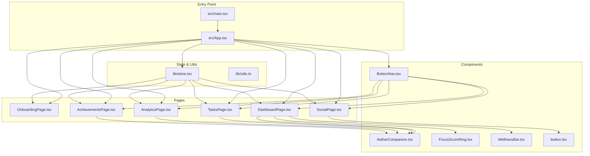
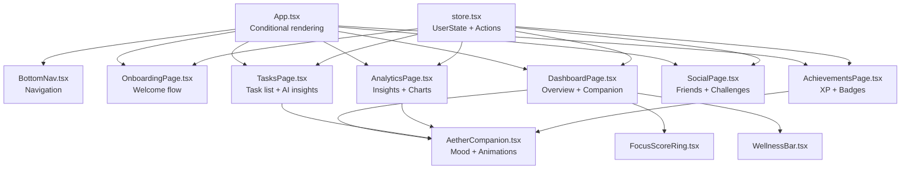
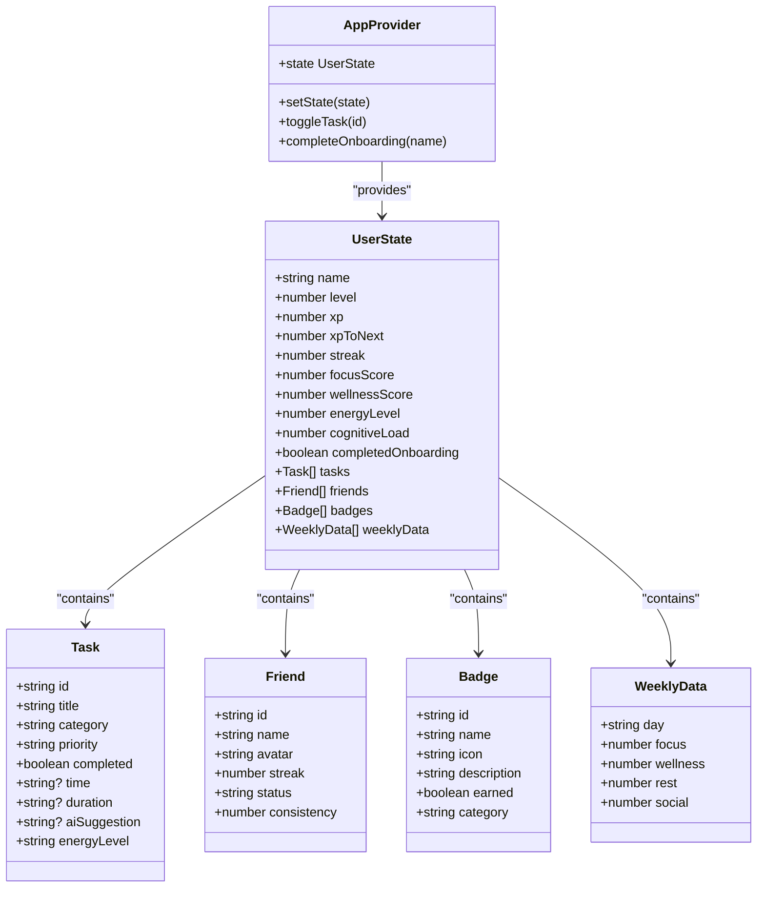
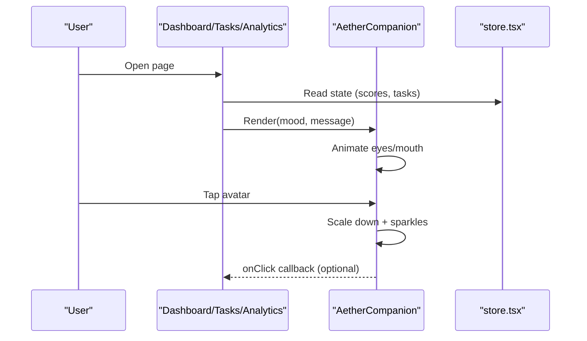
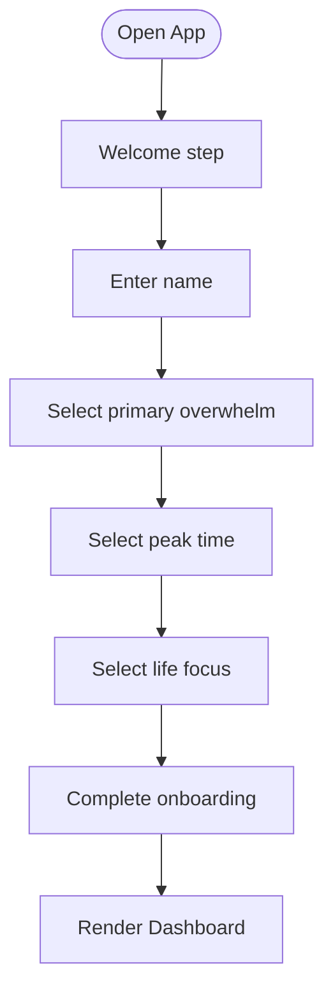
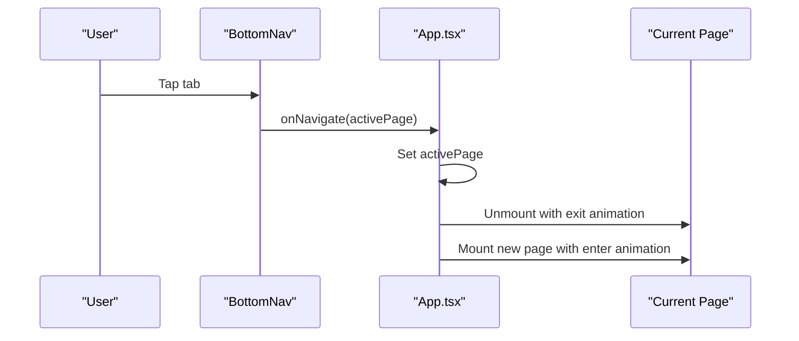
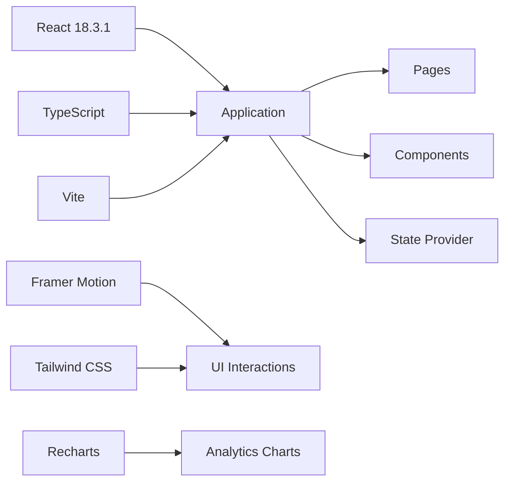

# AETHER
AN EMPHATETIC AI PLATFORM DESIGNED FOR EVERYDAY USE 
# Project Overview

<cite>
**Referenced Files in This Document**
- [package.json](file://package.json)
- [tailwind.config.ts](file://tailwind.config.ts)
- [src/main.tsx](file://src/main.tsx)
- [src/App.tsx](file://src/App.tsx)
- [src/lib/store.tsx](file://src/lib/store.tsx)
- [src/pages/OnboardingPage.tsx](file://src/pages/OnboardingPage.tsx)
- [src/pages/DashboardPage.tsx](file://src/pages/DashboardPage.tsx)
- [src/pages/TasksPage.tsx](file://src/pages/TasksPage.tsx)
- [src/pages/AnalyticsPage.tsx](file://src/pages/AnalyticsPage.tsx)
- [src/pages/SocialPage.tsx](file://src/pages/SocialPage.tsx)
- [src/pages/AchievementsPage.tsx](file://src/pages/AchievementsPage.tsx)
- [src/components/companion/AetherCompanion.tsx](file://src/components/companion/AetherCompanion.tsx)
- [src/components/dashboard/FocusScoreRing.tsx](file://src/components/dashboard/FocusScoreRing.tsx)
- [src/components/dashboard/WellnessBar.tsx](file://src/components/dashboard/WellnessBar.tsx)
- [src/components/layout/BottomNav.tsx](file://src/components/layout/BottomNav.tsx)
- [src/components/ui/button.tsx](file://src/components/ui/button.tsx)
- [src/lib/utils.ts](file://src/lib/utils.ts)
</cite>

## Table of Contents
1. [Introduction](#introduction)
2. [Project Structure](#project-structure)
3. [Core Components](#core-components)
4. [Architecture Overview](#architecture-overview)
5. [Detailed Component Analysis](#detailed-component-analysis)
6. [Dependency Analysis](#dependency-analysis)
7. [Performance Considerations](#performance-considerations)
8. [Troubleshooting Guide](#troubleshooting-guide)
9. [Conclusion](#conclusion)

## Introduction
Samsung Aether Companion is a productivity and wellness platform designed to help users manage tasks intelligently while supporting holistic wellbeing. It blends AI-powered insights with a friendly, animated companion to guide users through daily routines, task scheduling, social connections, and personal growth. The application emphasizes sustainable productivity over burnout, offering real-time wellness monitoring, personalized AI companions, social features, and gamification elements such as XP, streaks, and badges.

Key value propositions:
- Real-time wellness monitoring: Visual wellness scores, cognitive load tracking, and energy metrics inform daily decisions.
- Personalized AI companions: An interactive, mood-responsive avatar provides encouragement, reminders, and actionable suggestions.
- Social features: Friends’ circles, wellness challenges, and focus groups foster community and accountability.
- Gamification: XP progression, level-ups, streaks, and badges reward consistency, balance, and rest.

Target audience:
- Productivity-focused individuals who seek a balanced approach to managing work, health, and relationships without sacrificing mental wellbeing.

Role in the Samsung ecosystem:
- As part of Samsung’s broader digital wellness vision, Aether Companion aligns with Samsung’s commitment to human-centered design and responsible technology. It complements Samsung’s wearable and mobile ecosystems by delivering insights and motivation grounded in real-time user data and behavioral patterns.

Positioning in the productivity app market:
- Unlike traditional task managers, Aether Companion integrates emotional and physical wellness metrics, AI-driven suggestions, and social reinforcement to create a more human-centric productivity experience.

## Project Structure
The application follows a feature-based structure with clear separation of concerns:
- Pages: Onboarding, Dashboard, Tasks, Analytics, Social, Achievements
- Components: Reusable UI elements and specialized widgets (e.g., FocusScoreRing, WellnessBar)
- Layout: Bottom navigation and shared UI primitives
- State: Centralized user state and actions via a React context provider
- Styling: Tailwind CSS with custom theme tokens and animations

**Diagram sources**
- [src/main.tsx:1-11](file://src/main.tsx#L1-L11)
- [src/App.tsx:1-57](file://src/App.tsx#L1-L57)
- [src/lib/store.tsx:1-155](file://src/lib/store.tsx#L1-L155)
- [src/components/layout/BottomNav.tsx:1-57](file://src/components/layout/BottomNav.tsx#L1-L57)
- [src/components/companion/AetherCompanion.tsx:1-189](file://src/components/companion/AetherCompanion.tsx#L1-L189)
- [src/components/dashboard/FocusScoreRing.tsx:1-55](file://src/components/dashboard/FocusScoreRing.tsx#L1-L55)
- [src/components/dashboard/WellnessBar.tsx:1-44](file://src/components/dashboard/WellnessBar.tsx#L1-L44)
- [src/components/ui/button.tsx:1-53](file://src/components/ui/button.tsx#L1-L53)
- [src/pages/OnboardingPage.tsx:1-209](file://src/pages/OnboardingPage.tsx#L1-L209)
- [src/pages/DashboardPage.tsx:1-175](file://src/pages/DashboardPage.tsx#L1-L175)
- [src/pages/TasksPage.tsx:1-219](file://src/pages/TasksPage.tsx#L1-L219)
- [src/pages/AnalyticsPage.tsx:1-233](file://src/pages/AnalyticsPage.tsx#L1-L233)
- [src/pages/SocialPage.tsx:1-223](file://src/pages/SocialPage.tsx#L1-L223)
- [src/pages/AchievementsPage.tsx:1-213](file://src/pages/AchievementsPage.tsx#L1-L213)

**Section sources**
- [src/main.tsx:1-11](file://src/main.tsx#L1-L11)
- [src/App.tsx:1-57](file://src/App.tsx#L1-L57)
- [src/lib/store.tsx:1-155](file://src/lib/store.tsx#L1-L155)

## Core Components
- App shell and routing: Conditional rendering of onboarding versus main pages, with animated transitions and a bottom navigation bar.
- State management: Centralized user state with actions to toggle tasks, update XP, and complete onboarding.
- Companion avatar: Mood-aware, interactive SVG character with animations and message bubbles.
- Dashboard widgets: Focus score ring, wellness bar, quick actions, timeline, XP progress, and wellness metrics.
- Task management: Filterable lists, priority indicators, AI suggestions, and schedule insights.
- Analytics: Weekly trends, distribution charts, and summary insights.
- Social hub: Friends list, statuses, wellness challenges, and focus groups.
- Achievements: Badges, streaks, XP, and reflection summaries.

**Section sources**
- [src/App.tsx:12-46](file://src/App.tsx#L12-L46)
- [src/lib/store.tsx:115-155](file://src/lib/store.tsx#L115-L155)
- [src/components/companion/AetherCompanion.tsx:11-189](file://src/components/companion/AetherCompanion.tsx#L11-L189)
- [src/pages/DashboardPage.tsx:20-175](file://src/pages/DashboardPage.tsx#L20-L175)
- [src/pages/TasksPage.tsx:30-219](file://src/pages/TasksPage.tsx#L30-L219)
- [src/pages/AnalyticsPage.tsx:111-233](file://src/pages/AnalyticsPage.tsx#L111-L233)
- [src/pages/SocialPage.tsx:105-223](file://src/pages/SocialPage.tsx#L105-L223)
- [src/pages/AchievementsPage.tsx:27-213](file://src/pages/AchievementsPage.tsx#L27-L213)

## Architecture Overview
The app uses a React 18.3.1 frontend with a centralized state provider and a feature-rich UI built with Tailwind CSS and Framer Motion. Pages are rendered conditionally after onboarding, and navigation is handled by a bottom tab bar with smooth transitions. The companion avatar is a reusable component integrated across pages to deliver contextual insights and encouragement.

**Diagram sources**
- [src/App.tsx:12-46](file://src/App.tsx#L12-L46)
- [src/components/layout/BottomNav.tsx:10-16](file://src/components/layout/BottomNav.tsx#L10-L16)
- [src/pages/OnboardingPage.tsx:57-209](file://src/pages/OnboardingPage.tsx#L57-L209)
- [src/pages/DashboardPage.tsx:20-175](file://src/pages/DashboardPage.tsx#L20-L175)
- [src/pages/TasksPage.tsx:30-219](file://src/pages/TasksPage.tsx#L30-L219)
- [src/pages/AnalyticsPage.tsx:111-233](file://src/pages/AnalyticsPage.tsx#L111-L233)
- [src/pages/SocialPage.tsx:105-223](file://src/pages/SocialPage.tsx#L105-L223)
- [src/pages/AchievementsPage.tsx:27-213](file://src/pages/AchievementsPage.tsx#L27-L213)
- [src/components/companion/AetherCompanion.tsx:11-189](file://src/components/companion/AetherCompanion.tsx#L11-L189)
- [src/components/dashboard/FocusScoreRing.tsx:7-55](file://src/components/dashboard/FocusScoreRing.tsx#L7-L55)
- [src/components/dashboard/WellnessBar.tsx:8-44](file://src/components/dashboard/WellnessBar.tsx#L8-L44)
- [src/lib/store.tsx:98-155](file://src/lib/store.tsx#L98-L155)

## Detailed Component Analysis

### State Management and Data Model
The centralized state encapsulates user profile, tasks, wellness metrics, social connections, badges, and weekly data. It exposes actions to toggle tasks (affecting XP) and to complete onboarding.

**Diagram sources**
- [src/lib/store.tsx:3-113](file://src/lib/store.tsx#L3-L113)
- [src/lib/store.tsx:115-155](file://src/lib/store.tsx#L115-L155)

**Section sources**
- [src/lib/store.tsx:98-155](file://src/lib/store.tsx#L98-L155)

### Companion Avatar Interaction Flow
The companion avatar responds to user context and interactions, displaying mood-appropriate animations and message bubbles.

**Diagram sources**
- [src/pages/DashboardPage.tsx:26-36](file://src/pages/DashboardPage.tsx#L26-L36)
- [src/pages/TasksPage.tsx:62-79](file://src/pages/TasksPage.tsx#L62-L79)
- [src/pages/AnalyticsPage.tsx:128-138](file://src/pages/AnalyticsPage.tsx#L128-L138)
- [src/components/companion/AetherCompanion.tsx:26-30](file://src/components/companion/AetherCompanion.tsx#L26-L30)

**Section sources**
- [src/components/companion/AetherCompanion.tsx:11-189](file://src/components/companion/AetherCompanion.tsx#L11-L189)
- [src/pages/DashboardPage.tsx:26-36](file://src/pages/DashboardPage.tsx#L26-L36)
- [src/pages/TasksPage.tsx:62-79](file://src/pages/TasksPage.tsx#L62-L79)
- [src/pages/AnalyticsPage.tsx:128-138](file://src/pages/AnalyticsPage.tsx#L128-L138)

### Onboarding Flow
The onboarding process collects user preferences to personalize the experience, culminating in completion that unlocks the main app.

**Diagram sources**
- [src/pages/OnboardingPage.tsx:57-209](file://src/pages/OnboardingPage.tsx#L57-L209)
- [src/App.tsx:16-18](file://src/App.tsx#L16-L18)

**Section sources**
- [src/pages/OnboardingPage.tsx:8-55](file://src/pages/OnboardingPage.tsx#L8-L55)
- [src/App.tsx:16-18](file://src/App.tsx#L16-L18)

### Navigation and Page Transitions
The bottom navigation controls page switching with animated transitions powered by Framer Motion.

**Diagram sources**
- [src/components/layout/BottomNav.tsx:18-56](file://src/components/layout/BottomNav.tsx#L18-L56)
- [src/App.tsx:14-45](file://src/App.tsx#L14-L45)

**Section sources**
- [src/components/layout/BottomNav.tsx:18-56](file://src/components/layout/BottomNav.tsx#L18-L56)
- [src/App.tsx:28-45](file://src/App.tsx#L28-L45)

## Dependency Analysis
Technology stack overview:
- React 18.3.1: Core framework for building user interfaces.
- TypeScript: Type safety across components, pages, and state.
- Vite: Build tool and dev server for fast development and builds.
- Framer Motion: Animation library for micro-interactions and page transitions.
- Tailwind CSS: Utility-first styling with a custom theme and animation tokens.
- Recharts: Charting library for analytics visualizations.

**Diagram sources**
- [package.json:11-32](file://package.json#L11-L32)
- [tailwind.config.ts:1-165](file://tailwind.config.ts#L1-L165)

**Section sources**
- [package.json:11-32](file://package.json#L11-L32)
- [tailwind.config.ts:18-161](file://tailwind.config.ts#L18-L161)

## Performance Considerations
- Prefer lightweight animations: Use Framer Motion sparingly and leverage hardware-accelerated properties (opacity, transform) for smoother performance.
- Optimize chart rendering: Defer heavy chart updates until data is ready; consider virtualization for long lists.
- Minimize re-renders: Keep state granular and avoid unnecessary context subscriptions.
- Bundle size: Tree-shake unused icons and animations; keep component libraries scoped to usage.

## Troubleshooting Guide
Common issues and resolutions:
- Context not wrapped: Ensure the app is wrapped in the provider so hooks like useApp can access state.
  - Verify provider presence around the root app element.
- Navigation not updating: Confirm active page state is managed and passed to the bottom navigation component.
- Animations stuttering: Reduce the number of simultaneous animations; simplify complex SVG paths if needed.
- Styling inconsistencies: Check Tailwind theme tokens and ensure custom shadows and gradients are defined.

**Section sources**
- [src/App.tsx:48-54](file://src/App.tsx#L48-L54)
- [src/lib/store.tsx:150-154](file://src/lib/store.tsx#L150-L154)

## Conclusion
Samsung Aether Companion redefines productivity by merging intelligent task management with holistic wellness. Its AI-powered companion, real-time metrics, social features, and gamified growth system position it uniquely in the market—focusing on sustainable habits, balance, and meaningful progress rather than just output. Built with modern web technologies and a thoughtful UI/UX, it offers a compelling model for digital wellness in the Samsung ecosystem and beyond.
